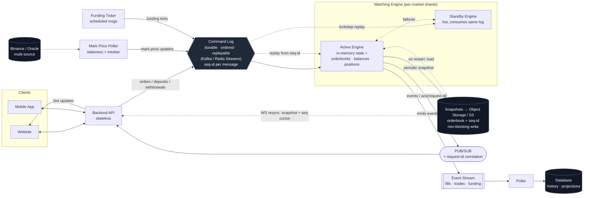

# PerpExchange — Architecture

The improved architecture. Three principles drive it:

1. **One durable, ordered, replayable log** is the engine's only input — orders, mark-price updates, and funding ticks all enter through it.
2. **Snapshot + log = recovery.** Snapshots carry the log sequence ID; restart = load snapshot, replay the log from that ID.
3. **Per-market sharding** — one single-threaded orderbook per market; parallelism is *across* markets, never inside one.

## Why each change

| Element | Purpose |
|---|---|
| **Single Command Log** | Orders + price + funding share one ordered stream, so liquidations are deterministically ordered against the trades around them. This log *is* the write-ahead log. |
| **Seq-id on every message** | Lets a snapshot say "I am state as of seq N" so replay resumes exactly, with no double-apply or gap. |
| **Snapshot → S3, non-blocking** | Durable (survives disk loss) and doesn't stall matching while writing. |
| **Standby engine** | Consumes the same log in lockstep → fast failover instead of minutes of cold replay. v1 can skip it; the seam (state = snapshot + log) makes it addable later. |
| **Per-market shards** | Concurrency across markets, single-threaded per book → keeps matching deterministic. This is what "Rust multi-processing" should mean. |
| **Mark Price Poller (median + staleness)** | Multi-source price, halts liquidations on stale feed instead of liquidating on a frozen number. |
| **Funding Ticker as messages** | Funding enters the log as scheduled messages, not a wall-clock timer → survives replay deterministically. |
| **Event Stream → Poller → DB** | Persistence is a downstream projection; DB is never read for trading decisions. |
| **PUB/SUB + request-id** | Real-time fan-out *and* the correlation path that routes a specific engine ack back to the specific client request. |
| **WS resync from snapshot + seq** | Reconnecting clients rebuild from a snapshot + cursor instead of drifting from engine truth. |
| **Withdrawals through the log** | The real-money exit is a first-class command: lock in engine → external transfer → confirm. |
